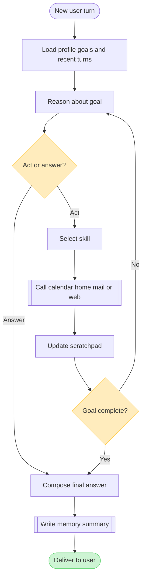
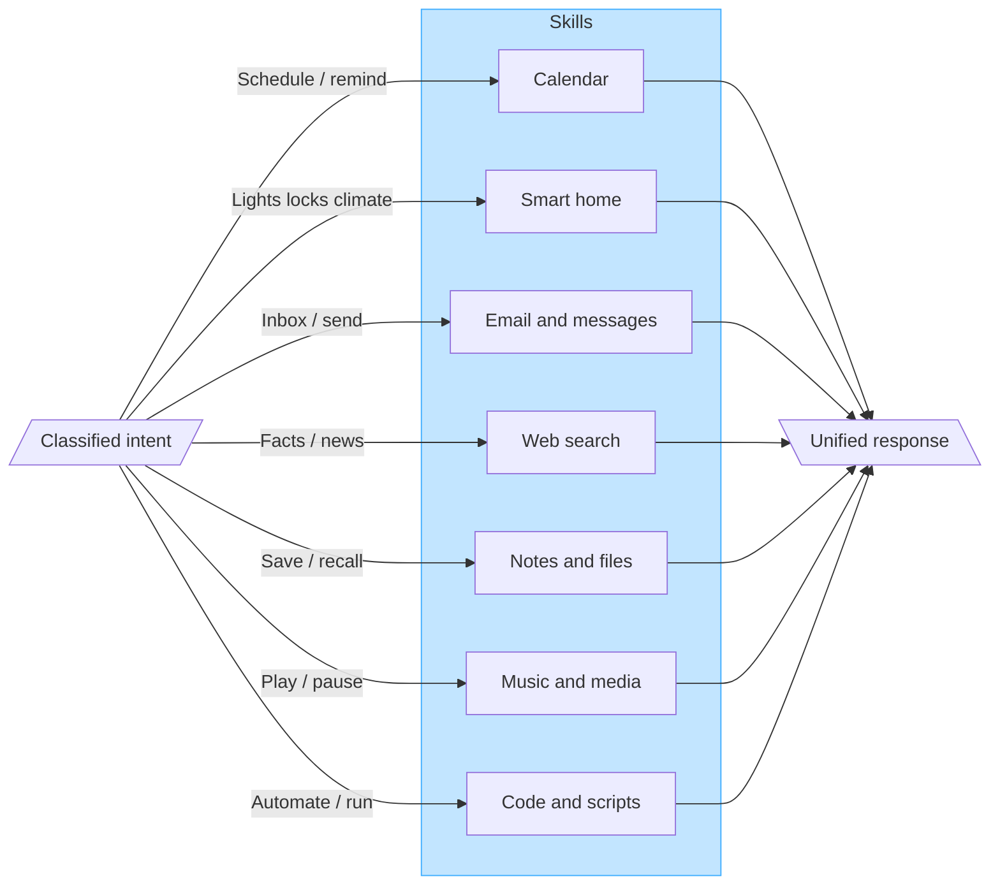
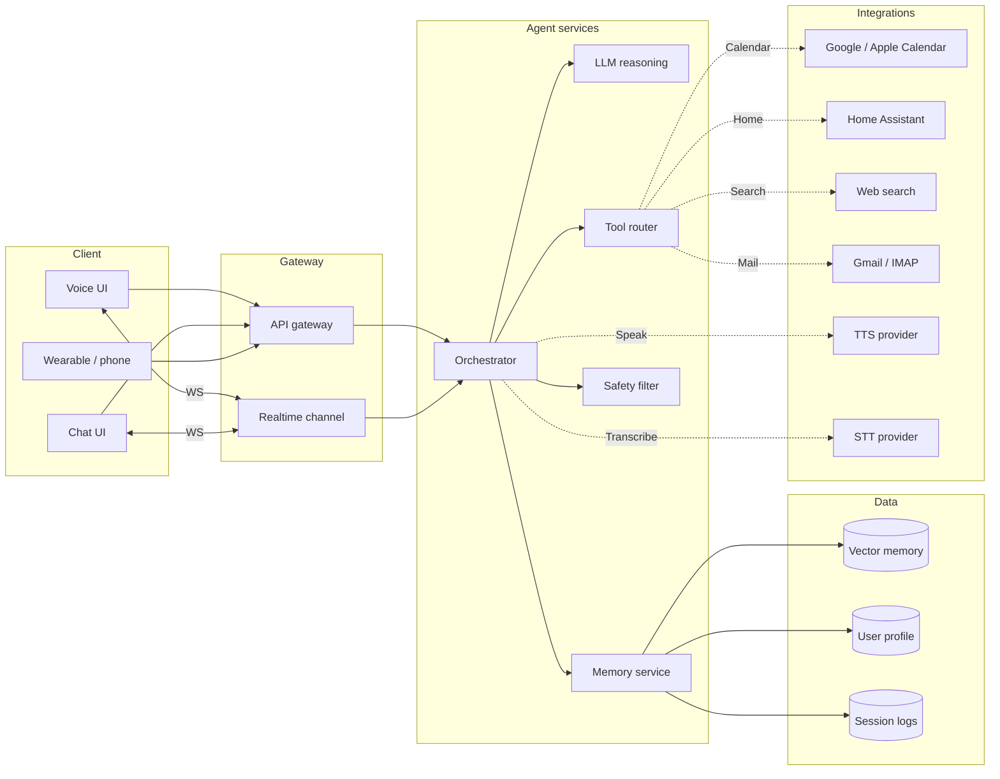

# Jarvis Personal AI Agent — Flowcharts

FigJam generation was unavailable (Figma MCP offline), so these Mermaid diagrams are the source of truth. Paste into [mermaid.live](https://mermaid.live) or open this file in any Mermaid-capable viewer.

---

## 1. Conversation request pipeline

How a single user request flows from input to spoken/written reply.

```mermaid
flowchart LR
    userIn([User speaks or types])
    wake{Wake word or always on?}
    listen[Capture audio or text]
    stt[[Speech to text]]
    nlu[Parse intent and entities]
    memory[(Long-term memory)]
    context[Build context pack]
    plan[Plan next actions]
    needTools{Needs tools?}
    route[Route to skill]
    runTool[[Execute tool]]
    observe[Observe tool result]
    more{More steps?}
    draft[Draft reply]
    safety{Safe to send?}
    revise[Revise reply]
    tts[[Text to speech]]
    userOut([Speak or show reply])
    idle([Wait for next input])

    userIn --> wake
    wake -->|"Yes / push-to-talk"| listen
    wake -->|"No"| idle
    listen --> stt
    stt --> nlu
    nlu -->|"Reads"| memory
    nlu --> context
    memory --> context
    context --> plan
    plan --> needTools
    needTools -->|"Yes"| route
    needTools -->|"No"| draft
    route --> runTool
    runTool --> observe
    observe --> more
    more -->|"Yes"| plan
    more -->|"No"| draft
    draft --> safety
    safety -->|"No"| revise
    revise --> safety
    safety -->|"Yes"| tts
    tts --> userOut
    userOut -.->|"Writes"| memory
    userOut --> idle

    style wake fill:#FFECBD,stroke:#FFC943
    style needTools fill:#FFECBD,stroke:#FFC943
    style more fill:#FFECBD,stroke:#FFC943
    style safety fill:#FFECBD,stroke:#FFC943
    style userOut fill:#CDF4D3,stroke:#66D575
    style revise fill:#FFCDC2,stroke:#FF7556
```

---

## 2. Agent brain — decision loop

Core planner loop after intent is known (ReAct-style).

---

## 3. Skill routing map

Which capability handles which request class.

---

## 4. System architecture overview

Deployable components for a home Jarvis-style agent.

---

## Legend

| Shape | Meaning |
| --- | --- |
| Stadium / circle | Start or end |
| Diamond | Decision |
| Double rectangle | Subroutine / external call |
| Cylinder | Datastore |
| Parallelogram | Input / output |

## Suggested next steps

1. Paste diagram 1 into FigJam when Figma is connected for an editable board.
2. Replace placeholder skill names with your real integrations.
3. Add auth and device pairing once you pick a stack (local vs cloud LLM).
